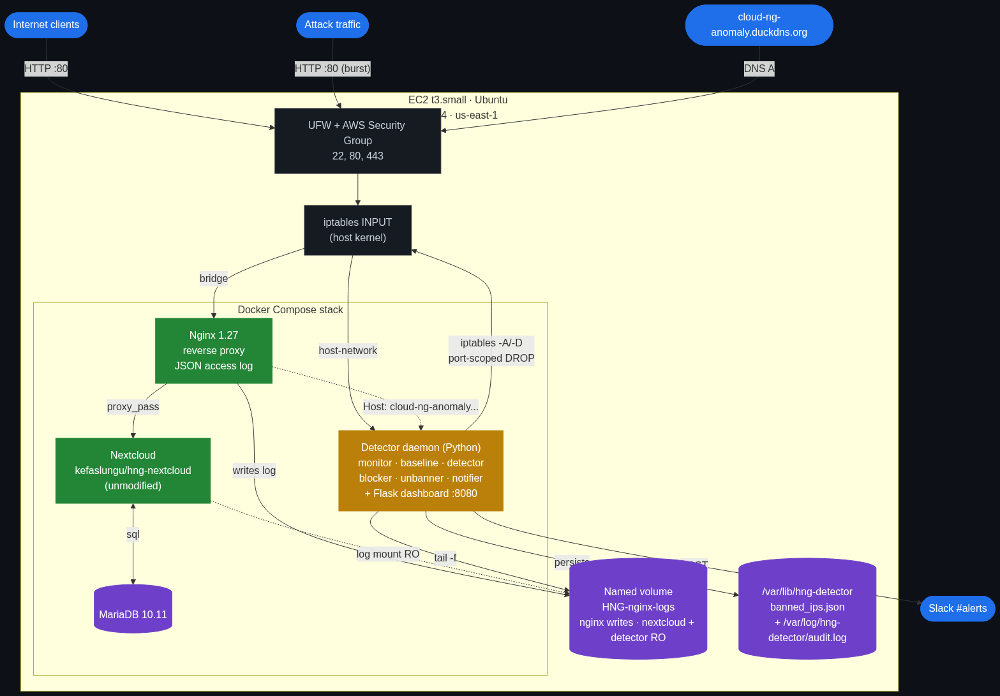

<h1 align="center">HNG Stage 3 — Anomaly Detection Engine</h1>

<p align="center">
  <em>A real-time HTTP anomaly &amp; DDoS detection daemon for a self-hosted Nextcloud cluster.</em><br/>
  Tails Nginx access logs &middot; learns its own baseline &middot; flags abnormal IPs and global spikes &middot;
  bans offenders at the kernel via iptables &middot; alerts to Slack &middot; reports live on a public dashboard.
</p>

<p align="center">
  
  
  
  
  
</p>

---

## Live deployment

| Endpoint | URL |
|---|---|
| **Public Nextcloud (IP only)** | `http://100.55.99.253` |
| **Live metrics dashboard (domain)** | <http://cloud-ng-anomaly.duckdns.org> |
| **GitHub repository** | <https://github.com/ibraheembello/hng-stage3-anomaly-detector> |
| **Beginner-friendly blog post (Dev.to)** | <https://dev.to/ibraheembello/building-a-real-time-anomaly-detection-engine-for-a-self-hosted-nextcloud-hng-stage-3-59km> |

---

## Table of contents

- [What this project does](#what-this-project-does)
- [Architecture](#architecture)
- [Why Python](#why-python)
- [How the sliding window works](#how-the-sliding-window-works)
- [How the baseline works](#how-the-baseline-works)
- [How detection makes a decision](#how-detection-makes-a-decision)
- [How banning works](#how-banning-works)
- [Repository layout](#repository-layout)
- [Configuration tunables](#configuration-tunables)
- [Runbook — fresh VPS to running stack](#runbook--fresh-vps-to-running-stack)
- [Verification &amp; testing](#verification--testing)
- [Audit log format](#audit-log-format)
- [Screenshots](#screenshots)
- [Teardown](#teardown)

---

## What this project does

The brief: a fictional cloud-storage company on top of Nextcloud has been seeing
suspicious traffic. The role of the detector is to watch every HTTP request
hitting the front door, decide what "normal" looks like in real time, and
respond when something deviates — a single aggressive IP, or a global traffic
spike — without operator intervention.

The deliverable runs as a long-lived **daemon** in Python that:

1. **Tails** the Nginx JSON access log line by line.
2. **Maintains** a 60-second sliding-window deque per source IP and one
   global deque.
3. **Computes** a rolling 30-minute baseline (mean + stddev) of per-second
   request counts, recalculated every 60 seconds, with **per-hour-of-day
   slots** so 3 a.m. traffic isn't compared against 3 p.m. traffic.
4. **Flags** an IP as anomalous when its z-score exceeds **3.0** *or* its
   rate exceeds **5×** the baseline mean — whichever fires first.
5. **Tightens** thresholds on an IP when its 4xx/5xx rate is 3× the
   baseline error rate.
6. **Bans** offending IPs at the host kernel via `iptables -A INPUT … -j DROP`
   (scoped to TCP ports 80/443 so SSH stays reachable for the operator).
7. **Releases** bans on a backoff schedule — **10 min → 30 min → 2 h →
   permanent** — and notifies Slack on every release.
8. **Alerts** Slack on every ban, unban, and global anomaly, with the
   condition that fired, the current rate, the baseline being compared
   against, the timestamp, and (where applicable) the ban duration.
9. **Reports** live on a Flask dashboard at a public domain that auto-refreshes
   every 3 seconds.
10. **Audits** every action with a structured log entry on disk so the
    sequence of events is always reproducible after the fact.

---

## Architecture



The stack is a single Docker Compose project running on a t3.small EC2
instance in `us-east-1`:

| Service | Image | Role |
|---|---|---|
| `db` | `mariadb:10.11` | Backing store for Nextcloud. Internal-only. |
| `nextcloud` | `kefaslungu/hng-nextcloud` (unmodified, per spec) | The application. Reachable only via the reverse proxy. |
| `nginx` | `nginx:1.27-alpine` | Reverse proxy on `:80`. Writes the JSON access log. Routes by `Host` header (Nextcloud on raw IP, dashboard on the DuckDNS domain). |
| `detector` | built locally from `detector/Dockerfile` | The daemon. Runs in the host network namespace with `NET_ADMIN` so it can manipulate iptables. |

A single named volume — **`HNG-nginx-logs`** — is the shared interface
between Nginx (writer) and Nextcloud + the detector (read-only mounters).

---

## Why Python

The brief allows Python or Go. I picked Python because:

- Every primitive the brief asks for ships in the standard library:
  `collections.deque` for the sliding window, `statistics.stdev` for the
  baseline, `threading` for the concurrency model, `subprocess` for the
  iptables shell-out, `dataclasses` for ergonomic record types.
- Thin third-party surface — only **Flask**, **PyYAML**, **psutil**, and
  **requests** — keeps the supply-chain risk and the audit cost low.
- Python's traceback ergonomics and dynamic typing make it faster to
  iterate against a moving baseline during development; the daemon is
  CPU-light (one short loop per log line plus a 60s recompute) so the
  language's overhead does not matter at our scale.
- Beginner-friendly to read for anyone reviewing the code.

---

## How the sliding window works

Each request that the monitor parses produces three side-effects in the
detector's state:

```
            event timestamp t (epoch seconds)
                       │
         ┌─────────────┼─────────────┐
         ▼             ▼             ▼
   global deque   per-IP deque   error deque (per-IP, only on 4xx/5xx)
```

**The deques never store anything but timestamps.** That keeps each entry to
8 bytes and makes the eviction step trivial:

```python
while deque and deque[0] <= now - WINDOW_SECONDS:
    deque.popleft()
deque.append(now)
```

`popleft()` from a `collections.deque` is O(1). Per request the work done
is bounded by the number of evictions, so the amortised cost is constant
even under attack volume. The current rate for a deque is simply
`len(deque) / WINDOW_SECONDS` (default **60 seconds**) — no minute-bucket
rounding, no rate-limiting library: a true rolling window.

The per-IP deques are dropped from memory after `idle_seconds`
(default 1800 s) of silence on that IP, by a small GC thread, so the
process footprint stays bounded.

---

## How the baseline works

The baseline keeps **per-second request counts** in a deque bounded by
`window_seconds=1800` (a 30-minute history). A separate dictionary holds
one such deque per hour of day (0..23):

```
global rolling 30-min deque ───►  mean, stddev
                                       ▲
hour-of-day slots ─────────────────────┘  (preferred when ≥300 samples)
```

Every **60 seconds**, the recompute thread:

1. Closes out the partial bucket the recorder is currently filling and
   zero-fills any silent seconds so a quiet stretch is not invisibly
   discarded.
2. Picks the hour-of-day slot for the current UTC hour if it has at
   least `hourly_min_samples` (300, i.e. five minutes of activity) — this
   is what the brief calls *prefer the current hour's baseline when it
   has enough data*. Otherwise it falls back to the rolling 30-minute
   deque.
3. Computes `statistics.fmean` and `statistics.stdev` over the chosen
   history.
4. Applies floor values (`mean_floor=1.0`, `stddev_floor=0.5`) so the very
   first request after a quiet period does not produce an explosive
   z-score from a near-zero denominator.
5. Writes a `BASELINE` row to the audit log with the mean, stddev,
   sample count, and which slot was used.

---

## How detection makes a decision

For each parsed request the detector:

1. Evicts old entries from the global deque and from the per-IP deque.
2. Appends the new timestamp to both, plus to the per-IP error deque if
   the response was 4xx/5xx.
3. **Error-surge check.** If `ip_error_rate >= baseline_error_mean × 3`,
   the IP is marked surge-active and its detection thresholds are
   tightened (`zscore × 0.7`, `rate_multiplier × 0.7`).
4. **Per-IP verdict.** Compute `z = (ip_rate - mean) / max(stddev, ε)`.
   The IP is anomalous if `z > 3.0` *or* `ip_rate > 5 × mean`.
5. **Global verdict.** If per-IP did not fire (or this IP was already
   flagged this window), repeat the same test against the global deque.
   A global anomaly produces an alert only — never a ban.

The first verdict per IP is forwarded to the blocker. A small dedupe
keeps a single sustained burst from generating a fresh ban every second;
the dedupe entry is cleared by the unbanner when the IP is later released.

---

## How banning works

The blocker shells out to `iptables` directly. Why subprocess instead of
a Python netlink library? It mirrors what an SRE would type at the prompt
during an incident, making the audit trail trivially reproducible.

```bash
iptables -I INPUT -p tcp -s <ip> --dport 80  -j DROP
iptables -I INPUT -p tcp -s <ip> --dport 443 -j DROP
```

Scoping to TCP 80/443 means a banned source can still reach SSH —
critical because admin workstations occasionally trip the detector and
losing SSH access to your own host is the kind of mistake you only make
once.

Ban records are persisted to `/var/lib/hng-detector/banned_ips.json` so
the ledger survives a daemon restart, including the **`ban_count`** —
which is what makes the backoff escalate. When the same IP misbehaves
again after a release, the schedule jumps to the next tier (10 min →
30 min → 2 h → permanent).

The unbanner thread polls every 5 seconds, removes the iptables rule
whose `expires_at` is in the past, sends a Slack notification, and
clears the detector's per-IP dedupe so a fresh ban can fire on a repeat
offence.

---

## Repository layout

```
.
├── detector/
│   ├── main.py            # entry point; wires everything together
│   ├── monitor.py         # log tail + JSON parse, yields LogEvent
│   ├── baseline.py        # rolling baseline, mean/stddev/per-hour slot
│   ├── detector.py        # sliding window + z-score / multiplier verdict
│   ├── blocker.py         # iptables + ban ledger + audit log
│   ├── unbanner.py        # backoff release thread
│   ├── notifier.py        # Slack incoming webhook poster
│   ├── dashboard.py       # Flask metrics page + JSON API
│   ├── config.yaml        # all thresholds, paths, intervals
│   ├── requirements.txt   # Flask, PyYAML, psutil, requests
│   └── Dockerfile         # Python 3.12-slim + iptables + tini
├── nginx/
│   └── nginx.conf         # reverse proxy + JSON access-log format
├── docs/
│   ├── architecture.png   # rendered dataflow diagram
│   └── architecture.mmd   # Mermaid source for the same
├── screenshots/           # the seven required evidence PNGs
├── docker-compose.yml     # the four-service stack + named volume
├── .env.example           # shape of the runtime env file
├── .gitignore
└── README.md
```

---

## Configuration tunables

Everything in `detector/config.yaml`. Highlights:

| Group | Key | Default | What it controls |
|---|---|---|---|
| `window` | `duration_seconds` | 60 | Sliding-window length (per-IP and global). |
| `baseline` | `window_seconds` | 1800 | Rolling baseline horizon (30 min). |
| `baseline` | `recalc_interval_seconds` | 60 | Recompute cadence. |
| `baseline` | `hourly_min_samples` | 300 | Hourly slot kicks in after 5 min of activity. |
| `baseline` | `mean_floor` | 1.0 | Lower bound on the mean. |
| `baseline` | `stddev_floor` | 0.5 | Lower bound on the stddev. |
| `detection` | `zscore_threshold` | 3.0 | Sigma cutoff. |
| `detection` | `rate_multiplier` | 5.0 | Hard rate-vs-mean ceiling. |
| `detection` | `error_surge_multiplier` | 3.0 | When 4xx/5xx rate triggers tightening. |
| `ban` | `ports` | `[80, 443]` | TCP ports the DROP rule applies to. |
| `ban` | `schedule_seconds` | `[600, 1800, 7200]` | Backoff tiers; permanent after the last. |
| `dashboard` | `bind_port` | 8080 | Internal Flask port; Nginx fronts it on :80. |

---

## Runbook — fresh VPS to running stack

These steps reproduce the live deployment on a clean Ubuntu 24.04 VPS.

### 1. Provision the VPS

- AWS EC2 in `us-east-1`, **t3.small** (2 vCPU / 2 GB RAM), Ubuntu 24.04 LTS, 20 GiB gp3 root.
- Security group: 22, 80, 443 inbound from your trusted source(s); 0.0.0.0/0 for 80/443 once you're done testing.
- Allocate the key pair, save the `.pem` somewhere safe.

### 2. Install Docker, the Compose plugin, and a host firewall

SSH in as `ubuntu` and run:

```bash
sudo apt-get update -y
sudo DEBIAN_FRONTEND=noninteractive apt-get upgrade -y -o Dpkg::Options::="--force-confnew"
sudo apt-get install -y ca-certificates curl gnupg lsb-release git ufw htop jq python3-pip

# Docker official repo
sudo install -m 0755 -d /etc/apt/keyrings
curl -fsSL https://download.docker.com/linux/ubuntu/gpg | sudo gpg --dearmor -o /etc/apt/keyrings/docker.gpg
sudo chmod a+r /etc/apt/keyrings/docker.gpg
echo "deb [arch=$(dpkg --print-architecture) signed-by=/etc/apt/keyrings/docker.gpg] https://download.docker.com/linux/ubuntu $(. /etc/os-release; echo "$VERSION_CODENAME") stable" | sudo tee /etc/apt/sources.list.d/docker.list >/dev/null
sudo apt-get update -y
sudo apt-get install -y docker-ce docker-ce-cli containerd.io docker-buildx-plugin docker-compose-plugin
sudo systemctl enable --now docker
sudo usermod -aG docker ubuntu

# Host-level firewall (UFW). Allow the docker bridge to reach :8080 so the
# Nginx server-block can proxy to the dashboard daemon on the host.
sudo ufw default deny incoming
sudo ufw default allow outgoing
sudo ufw allow OpenSSH
sudo ufw allow 80/tcp
sudo ufw allow 443/tcp
sudo ufw allow from 172.16.0.0/12 to any port 8080 proto tcp
sudo ufw --force enable

# Re-login (or `newgrp docker`) so the docker group membership applies.
exit
```

### 3. Clone the repository

```bash
ssh -i path/to/key.pem ubuntu@<ec2-public-ip>
git clone https://github.com/ibraheembello/hng-stage3-anomaly-detector.git
cd hng-stage3-anomaly-detector
```

### 4. Provide the runtime environment

Copy `.env.example` to `_private/.env` (or wherever `--env-file` will
point) and fill in the real values:

```bash
cp .env.example _private/.env
$EDITOR _private/.env
```

Required:
- `EC2_PUBLIC_IP` — your instance's public IPv4
- `DUCKDNS_DOMAIN` — the FQDN you'll publish for the dashboard
- `SLACK_WEBHOOK_URL` — incoming webhook for your `#alerts` channel
- DB credentials and Nextcloud admin credentials

Also make sure the host directories the detector mounts exist:

```bash
sudo mkdir -p /var/lib/hng-detector /var/log/hng-detector
sudo chown -R ubuntu:ubuntu /var/lib/hng-detector /var/log/hng-detector
```

### 5. Point your DuckDNS subdomain at the EC2 IP

```bash
curl "https://www.duckdns.org/update?domains=<your-subdomain>&token=<your-token>&ip=<ec2-public-ip>"
```

### 6. Bring the stack up

```bash
docker compose --env-file _private/.env up -d --build
docker compose --env-file _private/.env ps
```

The `db` container becomes healthy first; `nextcloud`, `nginx`, and
`detector` follow within a few seconds.

### 7. Confirm everything is reachable

```bash
curl -I http://<ec2-public-ip>/                       # 302 from Nextcloud
curl -I http://<your-domain>.duckdns.org/             # 200 from the dashboard
curl    http://<your-domain>.duckdns.org/api/metrics  # JSON snapshot
docker exec hng-nginx tail -3 /var/log/nginx/hng-access.log   # JSON access log
```

### 8. Watch the daemon

```bash
docker logs -f hng-detector
sudo tail -f /var/log/hng-detector/audit.log
sudo cat /var/lib/hng-detector/banned_ips.json
```

---

## Verification &amp; testing

A burst attack from a single IP will trip the per-IP path:

```bash
# from any external machine
for i in $(seq 1 400); do
  curl -s -o /dev/null -m 2 "http://<ec2-public-ip>/index.php?attack=$i" &
done
wait
```

Within seconds you should see:

- a `BAN <ip> | z-score …` line in `audit.log`
- two new DROP rules in `iptables -L INPUT -n` (TCP 80, TCP 443)
- a Slack message in `#alerts`
- the IP appears in `bans` on the dashboard

The unbanner releases the IP after the configured backoff (default 10
minutes for the first offence). On release a second Slack message and
an `UNBAN` audit row arrive; the `ban_count` stays at 1 so the next
offence escalates to 30 minutes.

---

## Audit log format

Every state change is appended to `/var/log/hng-detector/audit.log` in
exactly this shape — the format the brief specifies plus a `GLOBAL` row
for global anomalies (alert only):

```
[2026-04-26T00:30:52Z] BASELINE | hour=0 | mean=1.00 | stddev=0.50 | samples=300
[2026-04-26T00:31:22Z] BAN 102.88.55.19 | z-score 3.03 > 3.00 | rate=2.52 | baseline=1.00 | duration=600s
[2026-04-26T00:41:27Z] UNBAN 102.88.55.19 | z-score 3.03 > 3.00 | rate=2.52 | baseline=1.00 | duration=released | reason=scheduled-release
[2026-04-26T00:51:07Z] GLOBAL global | rate 11.28 > mean 2.26 x 5.00 | rate=11.28 | baseline=2.26 | duration=alert-only
```

---

## Screenshots

All seven evidence captures live in [`screenshots/`](screenshots/):

| File | Demonstrates |
|---|---|
| `Tool-running.png` | Daemon process up, tailing logs, threads spawned. |
| `Ban-slack.png` | Ban notification delivered to Slack. |
| `Unban-slack.png` | Auto-unban notification delivered to Slack. |
| `Global-alert-slack.png` | Global anomaly notification delivered to Slack. |
| `Iptables-banned.png` | `iptables -L -n` showing the active DROP rules. |
| `Audit-log.png` | Structured ban / unban / baseline rows. |
| `Baseline-graph.png` | Effective mean over time across two hourly slots. |

---

## Teardown

```bash
docker compose --env-file _private/.env down -v        # stops and removes volumes
sudo iptables -F INPUT                                 # flush ban rules (UFW will rebuild on reboot)
sudo rm -rf /var/lib/hng-detector /var/log/hng-detector
```

To delete the EC2 instance:

```bash
# in the AWS console: Instances → select → Instance state → Terminate
```

---

<p align="center"><sub>Built for the HNG Internship — Stage 3 DevOps track.</sub></p>
